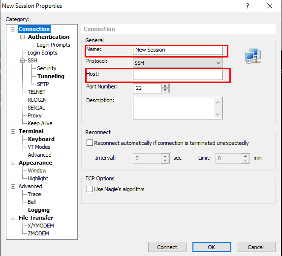
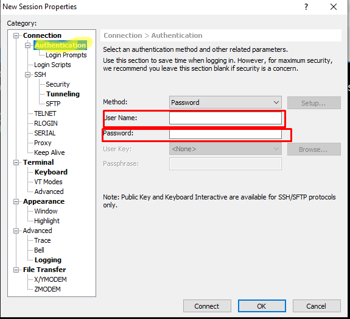

<h2>Xshell , Xftp התקנת</h2> 
במסגרת הקורס אנו נצטרך לעבוד עם פרוטוקול ssh , ftp ע"מ שנוכל לעבוד בקלות נצטרך להוריד 2 תכניות שימושיות מאוד (חינם לסטודנטים).

•	כנסו לקישור הבא:  https://www.netsarang.com/en/free-for-home-school/
הכניסו שם ואימייל רלוונטי (שימו לב עליכם להכניס אימייל פעיל היות וקישורי ההורדה נשלחים למייל שתכניסו.)
•	סמנו את התיבה "Both"
•	לחצו על הכפתור Download

קישור להורדת שני התוכנות יישלח למייל שהזנתם, עקבו אחר ההתקנה והתקינו את שני התוכנות.

ע"מ ליצור חיבור ssh  חדש:
1.	 לחצו על כפתור ה + בצד ימין 
2.	תנו שם לחיבור
3.	הזינו את כתובת הIP אליה אתם רוצים להתחבר (יכול להיות מספרים או URL)
4.	עברו ללשונית Authentication מצד ימין
5.	הזינו שם משתמש וסיסמא רלוונטיים 
6.	לחצו connect
 

 

